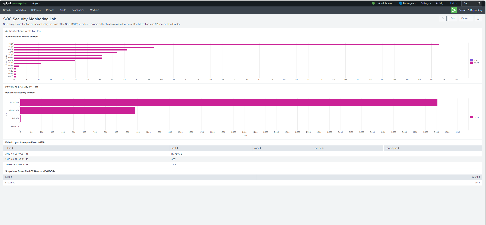

# 🔵 Splunk SOC Investigation Lab — BOTSv3


SOC triage case study using Splunk, Windows Security logs, and Sysmon to
investigate authentication anomalies and suspicious PowerShell activity
using the public Boss of the SOC (BOTSv3) dataset.



---

## 🎯 Objective

Perform SOC analyst triage across 1.28 million events in the BOTSv3
dataset using Windows Security and Sysmon telemetry. Identify suspicious
authentication activity, anomalous PowerShell execution, and potential
command-and-control behavior.

---

## 🔬 Environment

| Component | Detail |
|---|---|
| Platform | Splunk Enterprise (local lab) |
| Dataset | Boss of the SOC v3 (BOTSv3) — public Splunk lab dataset |
| Log Sources | WinEventLog:Security, XmlWinEventLog:Microsoft-Windows-Sysmon/Operational |
| Total Events | 1,280,642 |

---

## 🚨 Key Findings

### Finding 1 — Failed Logon Attempts (Event ID 4625)
- 3 failed logon events identified on hosts MKRAEUS-L and SEPM
- No brute-force pattern observed at this volume
- Severity: Low


### Finding 2 — Authentication Activity by Host (Event ID 4624/4625)
- BSTOLL-L generated the highest successful logon volume in the reviewed
  dataset window
- Activity should be validated against expected host role and baseline
  behavior


### Finding 3 — Anomalous PowerShell Volume
- FYODOR-L: 3,911 PowerShell Sysmon events
- ABUNGST-L: 1,079 events
- All other hosts: fewer than 10 events
- FYODOR-L was a significant outlier requiring investigation


### Finding 4 — Suspected PowerShell-Based C2 Activity on FYODOR-L
- PowerShell.exe executed as NT AUTHORITY\SYSTEM
- Repeated outbound HTTPS connections were observed to 45.77.53.176,
  which resolved to Vultr infrastructure in the lab evidence reviewed
- Connections occurred in a regular, beacon-like pattern
- Activity is consistent with suspicious PowerShell-based post-exploitation
  or command-and-control behavior


---

## 🧠 Analyst Assessment

FYODOR-L was the primary host of interest in this investigation. Compared
with peer systems, it generated a significantly elevated volume of
PowerShell-related Sysmon activity. Raw event review also showed
PowerShell.exe executing as NT AUTHORITY\SYSTEM and making repeated
outbound HTTPS connections to an external IP in a beacon-like pattern.
Taken together, these indicators are consistent with suspicious
post-exploitation or command-and-control activity and warrant deeper
host-based investigation.

---

## 🔍 SPL Searches Used

**Failed Logon Detection**
```
index=botsv3 sourcetype="WinEventLog:Security" EventCode=4625 earliest=0
| table _time, host, user, src_ip, LogonType
```

**Authentication Activity by Host**
```
index=botsv3 earliest=0 (EventCode=4624 OR EventCode=4625)
| stats count by EventCode, host
| sort -count
```

**PowerShell Activity by Host**
```
index=botsv3 sourcetype="XmlWinEventLog:Microsoft-Windows-Sysmon/Operational" earliest=0 PowerShell
| stats count by host
| sort -count
```

**Suspicious PowerShell Investigation on FYODOR-L**
```
index=botsv3 sourcetype="XmlWinEventLog:Microsoft-Windows-Sysmon/Operational" earliest=0 host="FYODOR-L" PowerShell
| table _time, host, Image, User, DestinationIp, DestinationHostname, DestinationPort, CommandLine
```

---

## 🗺️ MITRE ATT&CK Mapping

| Technique | ID | Description |
|---|---|---|
| PowerShell | T1059.001 | Adversary used PowerShell for execution |
| Application Layer Protocol: Web Protocols | T1071.001 | Possible C2 communication over HTTPS |
| Command and Scripting Interpreter | T1059 | Broad scripting and command interpreter execution behavior |

---

## 📁 Repository Structure
```
splunk-soc-lab/
├── README.md
├── screenshots/
│   ├── 01-botsv3-dataset-loaded.png
│   ├── 02-failed-logons-4625.png
│   ├── 03-logon-activity-by-host.png
│   ├── 04-powershell-activity-by-host.png
│   ├── 05-fyodor-c2-beacon.png
│   └── 06-soc-dashboard-complete.png
├── searches/
│   ├── failed_logons.spl
│   ├── auth_events_by_host.spl
│   ├── powershell_activity_by_host.spl
│   └── suspicious_powershell_c2.spl
└── report/
    └── investigation-summary.md
```

---

## 🏅 Skills Demonstrated

- Splunk SPL query writing
- Windows Security log analysis (Event IDs 4624, 4625)
- Sysmon operational log investigation
- Authentication anomaly detection
- PowerShell abuse detection
- Potential C2 beacon identification
- SOC dashboard creation
- MITRE ATT&CK mapping
- Analyst-style incident documentation

---

Built by [Lovedip Singh](https://github.com/Lovedipsingh)  
SOC Analyst portfolio project focused on Splunk, Sysmon, and Windows event investigation.
