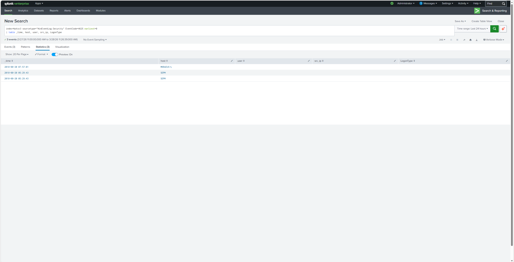
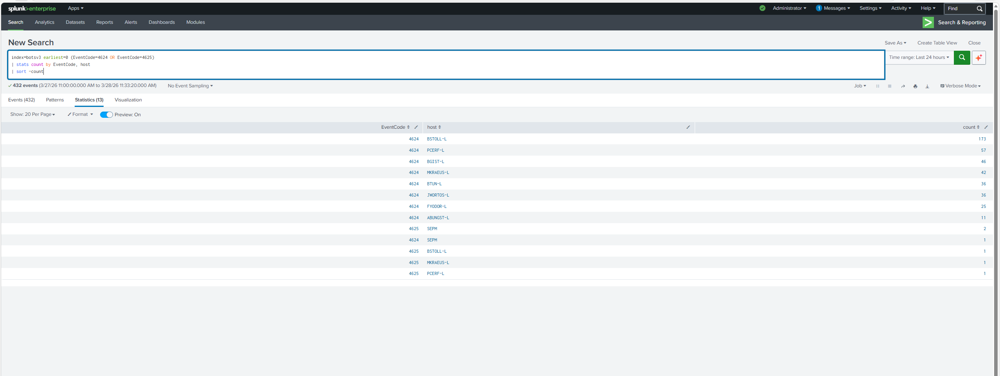
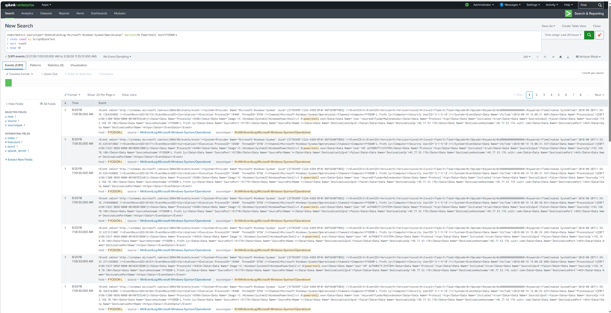

# 🔵 Splunk SOC Investigation Lab — BOTSv3


> SOC triage case study using Splunk, Windows Security logs, and Sysmon to investigate authentication anomalies, anomalous PowerShell execution, and suspected C2 beacon activity — using the public Boss of the SOC (BOTSv3) dataset.

---

## 🎯 Objective

Perform end-to-end SOC analyst triage across **1,280,642 events** in the BOTSv3 dataset using Windows Security and Sysmon telemetry. Identify suspicious authentication activity, anomalous PowerShell execution, and potential command-and-control (C2) behavior. Produce a structured analyst assessment with IOCs, MITRE ATT&CK mappings, and escalation recommendations.

---

## 🔬 Environment

| Component | Detail |
|---|---|
| Platform | Splunk Enterprise (local lab) |
| Dataset | Boss of the SOC v3 (BOTSv3) — public Splunk lab dataset |
| Log Sources | `WinEventLog:Security`, `XmlWinEventLog:Microsoft-Windows-Sysmon/Operational` |
| Total Events | 1,280,642 |
| Investigation Date | March 2026 |

---

## 📋 Executive Summary

Investigation of 1,280,642 BOTSv3 events identified **one high-priority host (FYODOR-L)** exhibiting strong indicators of active post-exploitation and C2 communication. FYODOR-L generated 3,911 PowerShell-related Sysmon events — compared to fewer than 10 on most peer hosts — with `powershell.exe` executing as `NT AUTHORITY\SYSTEM` and making repeated outbound HTTPS connections to `45.77.53.176` (Vultr-hosted infrastructure) in a consistent, beacon-like pattern.

Three additional hosts showed low-severity authentication anomalies requiring monitoring but no immediate escalation.

**FYODOR-L is the primary host of interest and the recommended escalation priority.**

---

## 🚨 Key Findings

### Finding 1 — Failed Logon Attempts (Event ID 4625)
- **Hosts:** MKRAEUS-L, SEPM (×2)
- **Volume:** 3 events total
- **Analysis:** Volume is well below brute-force threshold. No lateral movement indicators observed from these hosts in the same timeframe. No associated successful logons from unexpected sources.
- **Disposition:** ✅ Closed — low-severity authentication noise, no escalation required



---

### Finding 2 — Authentication Volume by Host (Event ID 4624/4625)
- **Host of note:** BSTOLL-L generated the highest successful logon volume (171 events) in the reviewed dataset window
- **Analysis:** Elevated logon count on BSTOLL-L should be validated against the host's expected role and baseline behavior. Without baseline context this is inconclusive, but warrants monitoring.
- **Disposition:** ⚠️ Monitor — validate BSTOLL-L activity against expected host role



---

### Finding 3 — Anomalous PowerShell Volume (Sysmon)

| Host | PowerShell Events |
|---|---|
| FYODOR-L | **3,911** ← significant outlier |
| ABUNGST-L | 1,079 |
| BGIST-L | 4 |
| BSTOLL-L | 2 |

- **Analysis:** FYODOR-L generated PowerShell activity approximately **3.6× higher** than the next closest host and **390× higher** than baseline peers. This volume alone is sufficient to flag FYODOR-L for priority investigation.
- **Disposition:** 🔴 Escalate — anomalous outlier, investigate immediately


---

### Finding 4 — Suspected PowerShell-Based C2 Activity on FYODOR-L ⚠️ HIGH SEVERITY

**This is the primary finding of this investigation.**

Raw Sysmon event review of FYODOR-L revealed the following:

- `powershell.exe` executing under `NT AUTHORITY\SYSTEM` (process path: `C:\Windows\System32\WindowsPowerShell\v1.0\powershell.exe`)
- Repeated outbound **HTTPS (port 443)** connections to **`45.77.53.176`**, resolving to `45.77.53.176.vultr.com` — a Vultr-hosted VPS with no legitimate business justification
- Events occurred in a **consistent, beacon-like pattern** across multiple timestamps within the same minute window
- Source port varied per connection; destination port was consistently **443**
- Activity initiated from **FYODOR-L.froth.ly** — a non-standard hostname suggesting a lab/compromised environment

**Assessment:** SYSTEM-level PowerShell beaconing to an external cloud VPS over HTTPS in a regular interval pattern is high-confidence post-exploitation behavior. This is consistent with an attacker-controlled implant or C2 framework (e.g., Empire, Cobalt Strike, Metasploit handler) maintaining persistence on FYODOR-L.

**Recommended escalation actions:**
1. Isolate FYODOR-L from the network immediately
2. Pull full `CommandLine` values from Sysmon Event ID 1 on FYODOR-L
3. Check for persistence mechanisms: scheduled tasks, registry run keys, new services
4. Review FYODOR-L user account activity for privilege escalation indicators
5. Submit `45.77.53.176` for threat intel enrichment (VirusTotal, Shodan, AbuseIPDB)
6. Capture and analyze HTTPS session content if network forensics are available

- **Disposition:** 🔴 Escalate — high-confidence C2 activity, isolate host



---

## 🧠 Analyst Assessment

FYODOR-L was the unambiguous primary host of interest in this investigation. Its PowerShell Sysmon event volume was an extreme statistical outlier compared to all peer systems. Direct event review confirmed `powershell.exe` running as `NT AUTHORITY\SYSTEM` — an unusual privilege level for interactive or scheduled PowerShell use — with repeated, pattern-consistent outbound HTTPS connections to a Vultr-hosted IP address.

The combination of SYSTEM-level execution, external C2 IP, consistent beacon timing, and high event volume constitutes a high-confidence indicator of active post-exploitation. This host should be treated as compromised pending forensic confirmation.

**Investigation Limitations:** This analysis was limited to Windows Security and Sysmon telemetry. Network flow data (NetFlow/PCAP) and endpoint memory forensics were not available in this dataset. Full confirmation of C2 payload and implant type would require packet capture analysis of the HTTPS sessions to `45.77.53.176` and memory acquisition from FYODOR-L.

---

## 📊 Investigation Summary

| Finding | Host | Severity | Disposition |
|---|---|---|---|
| Failed logon attempts | MKRAEUS-L, SEPM | 🟢 Low | Closed |
| Elevated authentication volume | BSTOLL-L | 🟡 Medium | Monitor |
| Anomalous PowerShell volume | FYODOR-L | 🔴 High | Escalate |
| Suspected PowerShell C2 beacon | FYODOR-L | 🔴 High | Isolate + Escalate |

---

## 🔍 SPL Searches Used

### Failed Logon Detection
```spl
index=botsv3 sourcetype="WinEventLog:Security" EventCode=4625 earliest=0
| table _time, host, user, src_ip, LogonType
```

### Authentication Activity by Host
```spl
index=botsv3 earliest=0 (EventCode=4624 OR EventCode=4625)
| stats count by EventCode, host
| sort -count
```

### PowerShell Activity by Host
```spl
index=botsv3 sourcetype="XmlWinEventLog:Microsoft-Windows-Sysmon/Operational" earliest=0 PowerShell
| stats count by host
| sort -count
```

### Suspicious PowerShell Investigation on FYODOR-L
```spl
index=botsv3 sourcetype="XmlWinEventLog:Microsoft-Windows-Sysmon/Operational" earliest=0 host="FYODOR-L" PowerShell
| table _time, host, Image, User, DestinationIp, DestinationHostname, DestinationPort, CommandLine
```

### PowerShell ScriptBlock Volume on FYODOR-L
```spl
index=botsv3 sourcetype="XmlWinEventLog:Microsoft-Windows-Sysmon/Operational" earliest=0 PowerShell host=FYODOR-L
| stats count by ScriptBlockText
| sort -count
| head 10
```

---

## 🗺️ MITRE ATT&CK Mapping

| Technique | ID | Evidence |
|---|---|---|
| PowerShell | T1059.001 | `powershell.exe` executing as SYSTEM with 3,911 Sysmon events on FYODOR-L |
| Application Layer Protocol: Web Protocols | T1071.001 | Outbound HTTPS to `45.77.53.176` in beacon-like pattern |
| Command and Scripting Interpreter | T1059 | Broad PowerShell-based execution behavior across investigation |
| System Services / Scheduled Task (suspected) | T1053 | Not confirmed — recommended follow-up investigation for persistence |

---

## 📁 Repository Structure

```
splunk-soc-lab/
├── README.md
├── screenshots/
│   ├── 01-botsv3-dataset-loaded.png
│   ├── 02-failed-logons-4625.png
│   ├── 03-logon-activity-by-host.png
│   ├── 04-powershell-activity-by-host.png
│   ├── 05-fyodor-c2-beacon.png
│   └── 06-soc-dashboard-complete.png
├── searches/
│   ├── failed_logons.spl
│   ├── auth_events_by_host.spl
│   ├── powershell_activity_by_host.spl
│   └── suspicious_powershell_c2.spl
└── report/
    └── investigation-summary.md
```

---

## 🏅 Skills Demonstrated

- Splunk SPL query writing and optimization
- Windows Security log analysis (Event IDs 4624, 4625)
- Sysmon operational log investigation
- Statistical outlier detection for alert triage
- Authentication anomaly analysis
- PowerShell abuse detection
- C2 beacon identification and IOC extraction
- MITRE ATT&CK mapping
- SOC dashboard creation
- Structured analyst-style incident documentation and escalation reporting

---

## 🔑 IOCs Identified

| Type | Value | Context |
|---|---|---|
| IP Address | `45.77.53.176` | Suspected C2 destination — Vultr VPS infrastructure |
| Hostname | `45.77.53.176.vultr.com` | Resolved hostname for C2 IP |
| Host | `FYODOR-L` | Compromised endpoint — primary host of interest |
| Process | `powershell.exe` (SYSTEM) | Execution under NT AUTHORITY\SYSTEM — anomalous |
| Port | `443 (HTTPS)` | C2 communication channel — encrypted beaconing |

---

*Built by Lovedip Singh — SOC Analyst portfolio project focused on Splunk, Sysmon, and Windows event investigation.*  
Last updated: April 2026

*[LinkedIn](https://linkedin.com/in/lovedip-singh-76802a1a3) | [GitHub](https://github.com/Lovedipsingh)*
